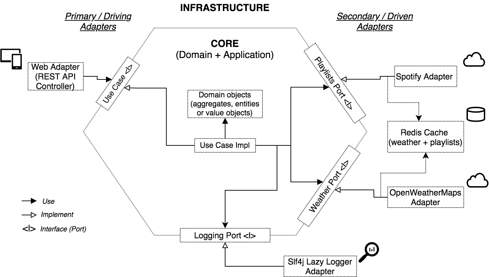

# MusiWeather API - Spring Boot Clean Architecture example 
An API system that returns playlist suggestions based on the current weather/temperature using a clean architecture with Spring Boot.  
  
**Environment requirements:**  
- JDK 11        
- Maven        
- Docker    

**Technologies:**
- Spring Boot
- Lombok 
- Swagger
- Mapstruct 
- OpenFeign 
- Redis 

## Business requirements  
**External API's:** 
- Weather info (temperature data) - [OpenWeatherMaps API](https://openweathermap.org/current)  
- Playlist suggestions - [Spotify API](https://developer.spotify.com/documentation/web-api/quick-start/)  
  
**Business rules:**  
- If temperature (in celsius) is below 15, suggest jazz musics   
- (...) between 15 and 19, suggest indie musics
- (...) between 20 and 26, suggest reggae musics
- (...) above 26, suggest party musics
  
**Use cases:**  
- Get suggested playlist by city name
- Get suggested playlist by location coordinates (lat and lon)

## Architecture  
A Clean & Hexagonal Architecture approach was followed as you can see in the diagram below: 



## API Documentation
Access http://localhost:8080/swagger-ui.html to check the documentation.

Rest endpoint to get playlist suggestion by coordinates: `GET http://localhost:8080/api/v1/playlist-weather?lat={latitude}&lon={longitude}`
```console
> curl 'http://localhost:8080/api/v1/playlist-weather?lat=40&lon=-80' | python -m json.tool
{
    "currentTemperature": 29.82,
    "playlistSuggested": {
        "description": "Mode: Turnt",
        "tracks": [
            {
                "artists": "Jack Harlow,Tory Lanez,DaBaby,Lil Wayne",
                "name": "WHATS POPPIN (feat. DaBaby, Tory Lanez & Lil Wayne) - Remix"
            },
            {
                "artists": "Gunna,Young Thug",
                "name": "DOLLAZ ON MY HEAD (feat. Young Thug)"
            },
            (...)
```
Rest endpoint to get playlist suggestion by city name:`GET http://localhost:8080/api/v1/playlist-weather?city={cityName}`
```console
> curl 'http://localhost:8080/api/v1/playlist-weather?city=lisbon' | python -m json.tool
{
    "currentTemperature": 37.01,
    "playlistSuggested": {
        "description": "Mode: Turnt",
        "tracks": [
            {
                "artists": "Jack Harlow,Tory Lanez,DaBaby,Lil Wayne",
                "name": "WHATS POPPIN (feat. DaBaby, Tory Lanez & Lil Wayne) - Remix"
            },
            {
                "artists": "Gunna,Young Thug",
                "name": "DOLLAZ ON MY HEAD (feat. Young Thug)"
            },
            (...)

```

## How to run  
***NOTE:** The required environment variables (SPOTIFY_CLIENT_ID, SPOTIFY_CLIENT_SECRET, OPENWEATHER_KEY) must be correctly set in [docker-compose.yml](docker-compose.yml) or diretly in [application.yml](/src/main/resources/application.yml).*

**With docker-compose**:  
 - Run the [startup.sh](/scripts/startup.sh)!
  
**Without docker-compose**:
 - Generate the artifact (.jar) from the spring boot app using the command `mvn clean package`;
 - Setup a Redis server in your environment (via Docker you can use the script [start_single_redis.sh](/scripts/start_single_redis.sh));
 - Run the maven spring boot plugin (`mvn spring-boot:run`) or directly the java command `java -jar <jar file location>`!

## TODO actions
- [ ] Tests (Junit + ArchUnit)
- [ ] CI/CD integration  

## References
[https://beyondxscratch.com/2017/08/19/decoupling-your-technical-code-from-your-business-logic-with-the-hexagonal-architecture-hexarch/](https://beyondxscratch.com/2017/08/19/decoupling-your-technical-code-from-your-business-logic-with-the-hexagonal-architecture-hexarch/)

[https://medium.com/sciforce/another-story-about-microservices-hexagonal-architecture-23db93fa52a2](https://medium.com/sciforce/another-story-about-microservices-hexagonal-architecture-23db93fa52a2)

[https://madewithlove.com/hexagonal-architecture-demystified/](https://madewithlove.com/hexagonal-architecture-demystified/)

[https://medium.com/swlh/hexagonal-architecture-in-java-b980bfc07366](https://medium.com/swlh/hexagonal-architecture-in-java-b980bfc07366)

[https://medium.com/@fabiojose/dipower-a76f453b38fd](https://medium.com/@fabiojose/dipower-a76f453b38fd)

[https://blog.wick.technology/sensible-feign/](https://blog.wick.technology/sensible-feign/)

[https://medium.com/@darguelles.rojas91/amazing-rest-clients-with-mr-feign-6195d5499a38](https://medium.com/@darguelles.rojas91/amazing-rest-clients-with-mr-feign-6195d5499a38)

[https://cloud.spring.io/spring-cloud-netflix/multi/multi_spring-cloud-feign.html](https://cloud.spring.io/spring-cloud-netflix/multi/multi_spring-cloud-feign.html)

[https://www.baeldung.com/mapstruct-custom-mapper](https://www.baeldung.com/mapstruct-custom-mapper)
